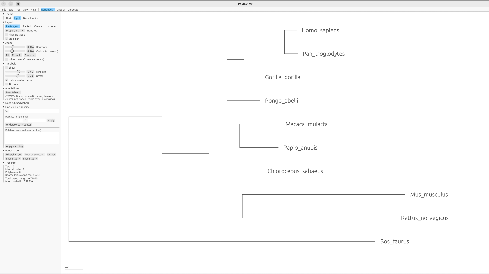
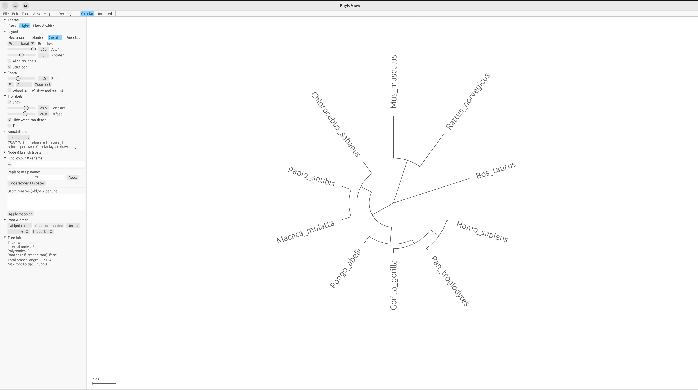

# PhyloGPU

FigTree/iTOL-style phylogenetic viewer & editor in Rust.

    cargo run --release [-- tree.nwk]

Linux needs the usual eframe deps (libxkbcommon, libgl, and GTK3 or xdg-desktop-portal for file dialogs).

## Annotations
Load a CSV/TSV (File ▸ Load annotation table, the side panel, or drop a .csv/.tsv on the window).
First column = tip name, other columns = tracks (numeric columns auto-detected).
Per track: colour strip, heatmap, bar chart or text; width; legend. Circular layout draws rings,
rectangular draws columns next to the tips. "Colour branches" paints clades by a column.
Try `examples_tree.nwk` + `examples_annotations.csv`.

## Themes
Dark, Light, Black & white (monochrome: greyscale annotations, pure-black lines; also applied to exports).

## Export
File ▸ Export PDF / SVG / Newick / NEXUS. Headless:

    phyloview tree.nwk --export out.pdf --annot table.csv --layout circular --theme bw
    (--layout rect|slanted|circular|unrooted, --theme dark|light|bw, optional --kinds strip,bar,text,...)

Gaurav Sablok \
gsablok@proton.me
